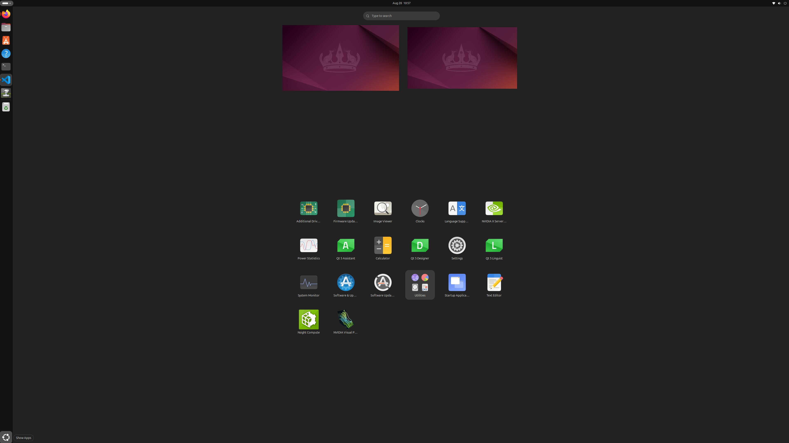
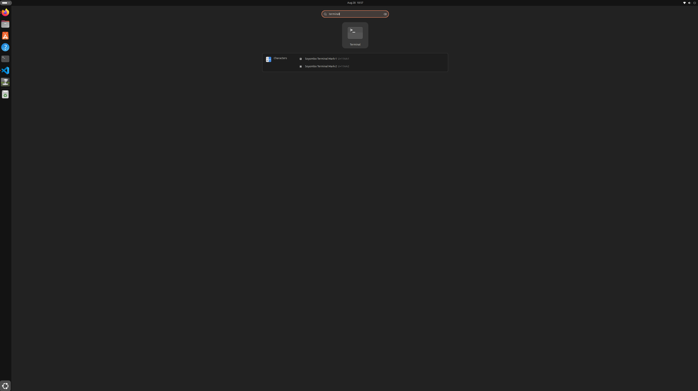
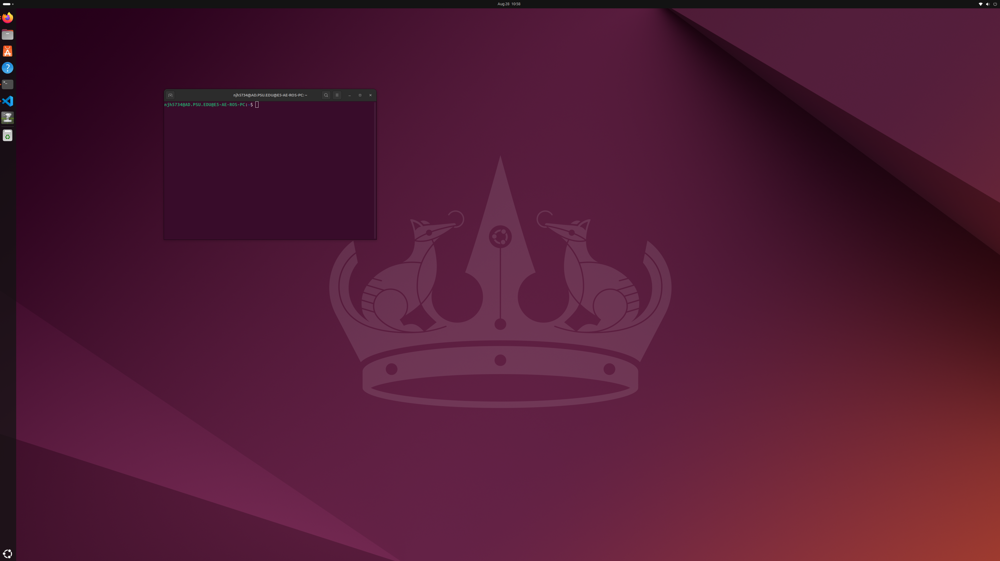
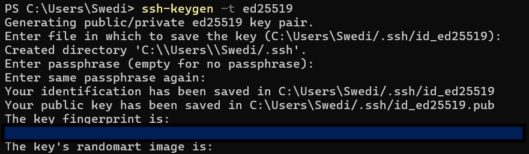
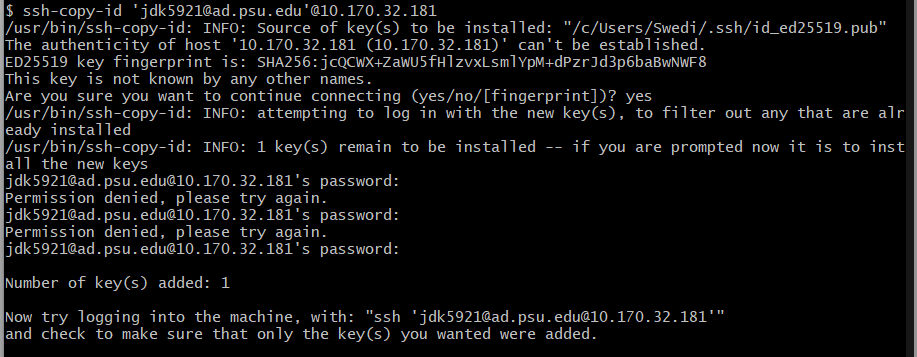
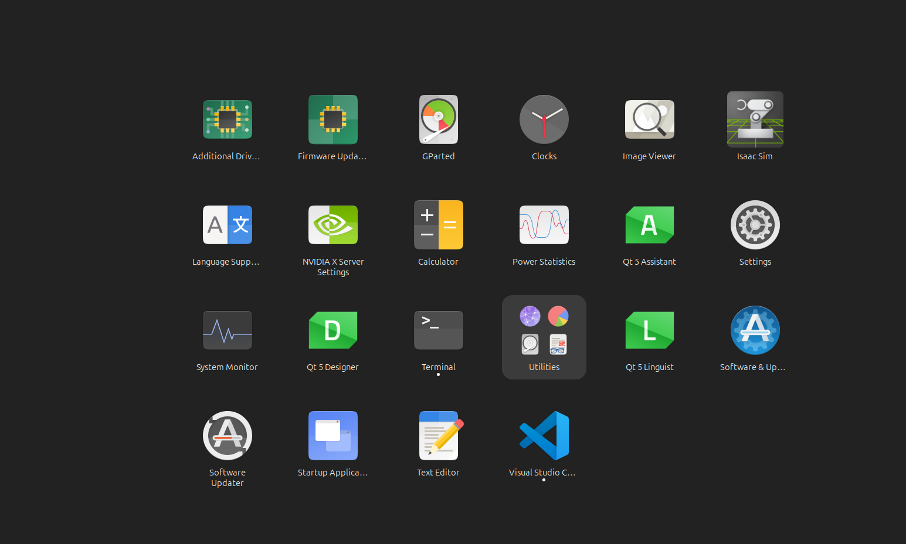
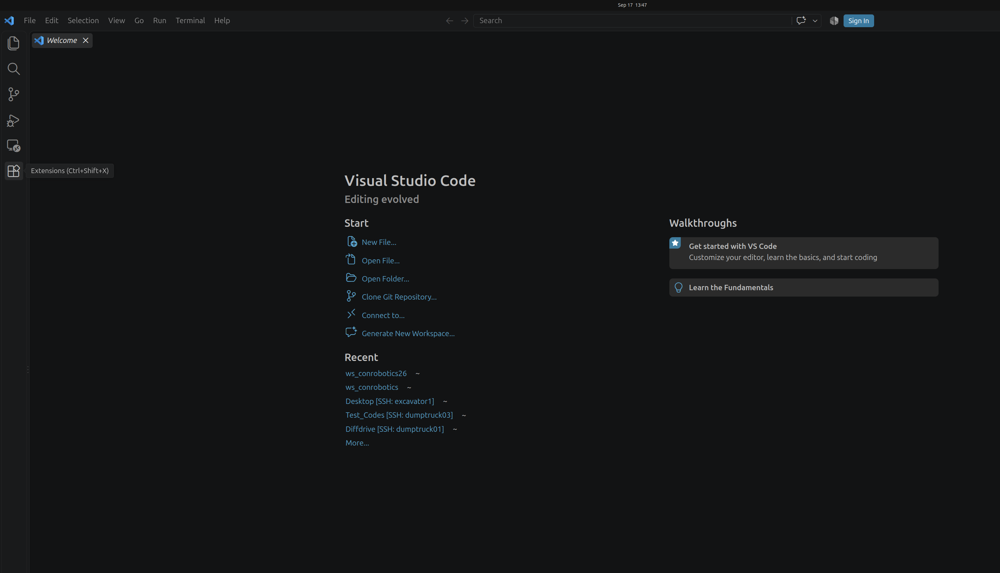
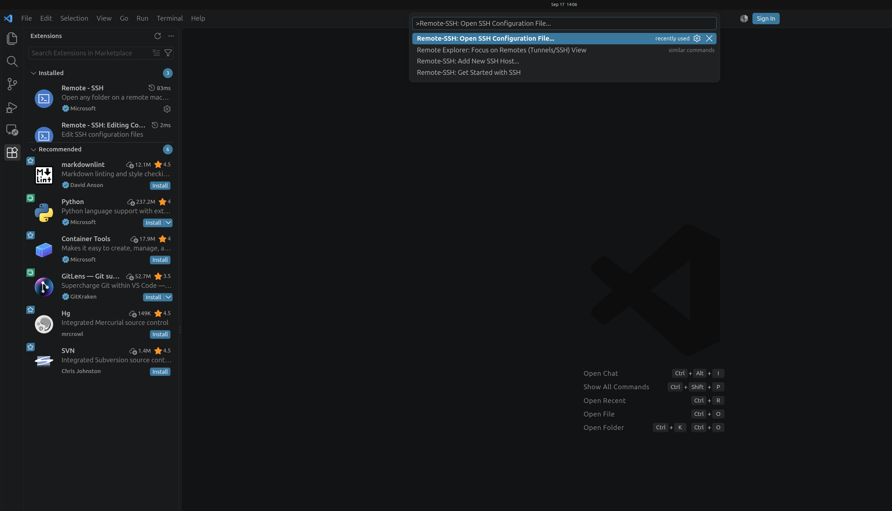
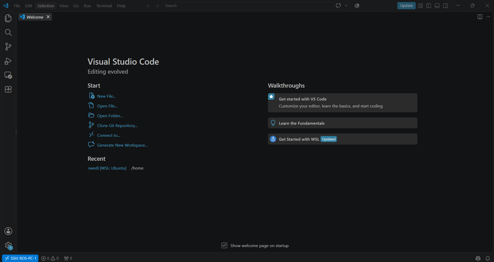

# Lab 01 — ROS 2 Network Setup

In this lab, you will configure remote access to the course ROS computer, connect to a Raspberry Pi, and establish ROS 2 communication between two computers.

By the end of this lab, you will be able to:

- remotely access the ROS computer using SSH
- use VS Code Remote SSH
- clone and build the course repository
- connect to a Raspberry Pi
- configure the course Zenoh network
- run ROS 2 nodes across two computers
- verify ROS 2 communication using a talker and listener

The CIC ConRobotics system uses the following basic network architecture:

```text
Your Laptop
     │
     │ SSH
     ▼
   ROS PC
     │
     ├── Zenoh Router
     │
     └──────────────┐
                    │
                    ▼
               Raspberry Pi
```

For ROS 2 communication, the important architecture is:

```text
1 Zenoh Router
      +
1 ROS PC
      +
N Robot Clients
```

---

# Part A — ROS Computer Setup

## Step 1 — Log In to the ROS Computer

For the initial setup, you must first log in to the ROS computer physically using your Penn State account.

> **Important:** You only need to complete this initial setup once.

### 1. Log in to Ubuntu

Log in to the ROS computer using your Penn State account.

Wait until the Ubuntu desktop has fully loaded.

### 2. Open a Terminal

Click **Show Apps** at the bottom-left corner of the desktop.



Search for **Terminal** and click the **Terminal** application.



A Terminal window should open.



You should see a command prompt similar to:

```text
your_psu_id@computer-name:~$
```

Do not close this terminal. You will use this for the next steps.

### 3. Confirm your user account

Run:

```bash
whoami
```

Press **Enter**.

You should see your PSU ID:

```text
your_psu_id
```

---

# Part B — Remote Development Setup

## Step 2 — Create an SSH Key

You will now configure your laptop so that you can remotely access the ROS computer without entering your Penn State password every time.

> **Important:** From this step forward, use **your own laptop**, not the physical ROS computer.

---

### 1. Open a Terminal on YOUR Laptop

Open a terminal on your laptop.

### macOS

Open:

```text
Terminal
```

### Windows

Use:

```text
Git Bash
```

> **Important for Windows users:** Use **Git Bash** for the SSH setup steps in this lab.

Windows PowerShell includes the `ssh` command, but it does not normally include `ssh-copy-id`.

Git Bash provides a Linux-like shell and allows you to use the same SSH commands shown in this lab.

If Git Bash is not installed, install Git for Windows first.

---

### 2. Check for an Existing SSH Key

Before creating a new SSH key, check whether your laptop already has one.

Run:

```bash
ls ~/.ssh/id_ed25519.pub
```

This command works in:

```text
macOS Terminal
Git Bash on Windows
```

If you see a file path similar to:

```text
/Users/your_username/.ssh/id_ed25519.pub
```

or:

```text
/c/Users/your_username/.ssh/id_ed25519.pub
```

you already have an SSH key.

> **Do not create a new key.**

Continue to:

```text
Step 2.5 — Connect to the PSU VPN
```

If you see a message similar to:

```text
No such file or directory
```

continue to the next section.

---

### 3. Generate an SSH Key

Run:

```bash
ssh-keygen -t ed25519
```

Press **Enter**.

You should see a message similar to:

```text
Generating public/private ed25519 key pair.

Enter file in which to save the key (.../.ssh/id_ed25519):
```

Press **Enter** to use the default location.

You will then be asked for a passphrase.

For this course setup, press **Enter** without typing anything.

After completing the prompts, you should see:

```text
Your identification has been saved in ...

Your public key has been saved in ...
```



### Checkpoint

Your SSH key has been successfully created.

---

## Step 2.5 — Connect to the PSU VPN

> **IMPORTANT:** Before attempting to connect to the ROS computer remotely, connect your laptop to the Penn State VPN.

Access https://www.it.psu.edu/software/ and download vpn.
Connect to the global protect.

### Checkpoint — PSU VPN

Before continuing, confirm that:

- [ ] Your laptop is connected to the Penn State VPN.
- [ ] The VPN connection is active.

> Keep the VPN connected while accessing the course ROS computers remotely.

---

## Step 3 — Copy Your SSH Key to the ROS Computer

Next, copy your SSH key to the ROS computer.

This allows you to connect without entering your Penn State password every time.

> **Important:** Keep the PSU VPN connected during this step.

---

### 1. Identify the ROS Computer

Use the ROS computer assigned to you for the lab.

Current course ROS computers include:

```text
ROS-PC-1    will be provided
ROS-PC-2    will be provided
```

> **Important:** Use the ROS computer assigned by the instructor.

---

### 2. Copy Your SSH Key

On your laptop, run:

```bash
ssh-copy-id 'YOUR_PSU_ID@AD.PSU.EDU'@ROS_COMPUTER_IP
```

Replace:

- `YOUR_PSU_ID` with your Penn State user ID
- `ROS_COMPUTER_IP` with the assigned ROS computer IP

Example:

```bash
ssh-copy-id 'abc123@AD.PSU.EDU'@10.170.xx.xxx
```

### Windows Users

Run this command from:

```text
Git Bash
```

Do **not** use PowerShell for the `ssh-copy-id` step.

Example:

```bash
ssh-copy-id 'abc123@AD.PSU.EDU'@xx.xxx.xx.xxx
```

---

### 3. Confirm the First Connection

If this is your first connection, you may see:

```text
The authenticity of host '10.170.xx.xxx (10.170.xx.xxx)' can't be established.

ED25519 key fingerprint is SHA256:...

Are you sure you want to continue connecting (yes/no/[fingerprint])?
```



Type:

```text
yes
```

and press **Enter**.

This message is normal.

---

### 4. Enter Your Penn State Password

You may be asked for your Penn State password.

Your password will not appear while you type.

You will not see:

```text
letters
dots
asterisks
```

This is normal.


If the SSH key was copied successfully, you should see:

```text
Number of key(s) added: 1
```


---

### 5. Test the SSH Connection

Run:

```bash
ssh 'YOUR_PSU_ID@AD.PSU.EDU'@ROS_COMPUTER_IP
```

Example:

```bash
ssh 'abc123@AD.PSU.EDU'@10.170.xx.xxx
```

If configured correctly, you should connect without entering your Penn State password.

The prompt should look similar to:

```text
abc123@AD.PSU.EDU@E5-AE-ROS-PC:~$
```


### Checkpoint — Passwordless SSH Connection

Confirm that:

- [ ] The PSU VPN is connected.
- [ ] Your SSH key was copied to the ROS computer.
- [ ] You can connect from your laptop.
- [ ] You are not asked for your Penn State password.

To return to your laptop:

```bash
exit
```

---

## Step 4 — Configure VS Code Remote SSH

You will now configure **Visual Studio Code (VS Code)** to remotely access the ROS computer.

After completing this setup, you will be able to edit files and run commands directly on the ROS computer from your laptop.

> **Important:** Complete this step on **your own laptop**.

> Keep the PSU VPN connected while using the remote ROS computers.

---

### 1. Open VS Code

Open **Visual Studio Code**.

---

### 2. Install Remote - SSH

Open the **Extensions** panel.

Search for:

```text
Remote - SSH
```

Install the extension from Microsoft.

If it is already installed, continue.

---

### 3. Open the SSH Configuration File

Open the VS Code **Command Palette**.

### macOS

```text
Command + Shift + P
```

### Windows

```text
Ctrl + Shift + P
```

Search for:

```text
Remote-SSH: Open SSH Configuration File...
```


Select your user SSH configuration file.

### macOS/Linux

```text
~/.ssh/config
```

### Windows

```text
C:\Users\YOUR_USERNAME\.ssh\config
```

---

### 4. Add the Course Computers

Add the following configuration:

```text
Host dumptruck1
    HostName 10.170.xx.xxx
    User besure
    IdentityFile ~/.ssh/id_ed25519

Host dumptruck3
    HostName 10.170.xx.xxx
    User besure
    IdentityFile ~/.ssh/id_ed25519

Host dumptruck4
    HostName 10.170.xx.xx
    User besure
    IdentityFile ~/.ssh/id_ed25519

Host dumptruck5
    HostName 10.170.xx.xxx
    User besure
    IdentityFile ~/.ssh/id_ed25519

Host excavator1
    HostName 10.170.xx.xxx
    User besure
    IdentityFile ~/.ssh/id_ed25519

Host excavator2
    HostName 10.170.xx.xxx
    User besure
    IdentityFile ~/.ssh/id_ed25519

Host excavator3
    HostName 10.170.xx.xxx
    User besure
    IdentityFile ~/.ssh/id_ed25519

Host ROS-PC-1
    HostName 10.170.xx.xxx
    User YOUR_PSU_ID@AD.PSU.EDU
    IdentityFile ~/.ssh/id_ed25519

Host ROS-PC-2
    HostName 10.170.xx.xxx
    User YOUR_PSU_ID@AD.PSU.EDU
    IdentityFile ~/.ssh/id_ed25519
```

Replace:

```text
YOUR_PSU_ID
```

with your Penn State user ID.

> **Important:** Do not change `HostName` unless instructed to do so.

Save the file.

---

### 5. Connect to the ROS Computer

Open the Command Palette again.

Search for:

```text
Remote-SSH: Connect to Host...
```

Select:

```text
ROS-PC-1
```

or:

```text
ROS-PC-2
```

depending on your assignment.

A new VS Code window should open.

If VS Code asks for the operating system of the remote computer, select:

```text
Linux
```

---

### 6. Confirm the Remote Connection

Look at the bottom-left corner of VS Code.

You should see something similar to:

```text
SSH: ROS-PC-1
```



### Checkpoint — VS Code Remote Connection

Confirm that:

- [ ] Remote - SSH is installed.
- [ ] Your ROS computer appears in the host list.
- [ ] You can connect to the ROS computer.
- [ ] VS Code shows the active remote connection.

> Even though VS Code is displayed on your laptop, commands in this remote window are now running on the **ROS computer**.

---

# Part C — Course Repository Setup

## Step 5 — Clone the Course Repository

You will now download the course GitHub repository to the ROS computer.

> **Important:** Make sure your VS Code window is remotely connected to the ROS computer.

---

### 1. Open a Terminal in VS Code

Select:

```text
Terminal → New Terminal
```

The prompt should look similar to:

```text
your_psu_id@AD.PSU.EDU@E5-AE-ROS-PC:~$
```

---

### 2. Create the Course Workspace

Run:

```bash
mkdir -p ~/ws_conrobotics
cd ~/ws_conrobotics
```

---

### 3. Clone the Course Repository

Run:

```bash
git clone https://github.com/CICPSU/CIC-ConRobotics-2026.git
```

Enter the repository:

```bash
cd ~/ws_conrobotics/CIC-ConRobotics-2026
```

---

### 4. Select the Course Branch

For the current course development environment:

```bash
git checkout dev
```

Confirm:

```bash
git branch --show-current
```

Expected:

```text
dev
```

---

### 5. Check the Repository

Run:

```bash
ls
```

You should see directories such as:

```text
robots
common
perception
command_center
operations
network
labs
docs
tools
```

### Checkpoint — Repository Downloaded

Confirm that:

- [ ] VS Code is remotely connected to the ROS computer.
- [ ] The repository was successfully cloned.
- [ ] You are on the correct branch.
- [ ] You are inside `CIC-ConRobotics-2026`.
- [ ] You can see the repository contents.

---

## Step 6 — Build the ROS 2 Workspace

Next, build the ROS 2 packages used by the course.

### 1. Set Up ROS 2

```bash
cd ~/ws_conrobotics/CIC-ConRobotics-2026

source /opt/ros/jazzy/setup.bash
```

The `source` command configures the current Terminal so it can find ROS 2.

---

### 2. Build the Workspace

Run:

```bash
colcon build --symlink-install
```

The build may take some time.

When complete, the build summary should show that the packages finished successfully.

---

### 3. Load the Course Workspace

Run:

```bash
source install/setup.bash
```

You must source both ROS 2 and the course workspace when opening a new Terminal:

```bash
source /opt/ros/jazzy/setup.bash
source ~/ws_conrobotics/CIC-ConRobotics-2026/install/setup.bash
```

### Checkpoint — ROS 2 Workspace Built

Confirm that:

- [ ] `colcon build --symlink-install` completed without errors.
- [ ] The `install` directory was created.
- [ ] You successfully ran `source install/setup.bash`.

---

# Part D — Connect to the Raspberry Pi

## Step 7 — Connect to Your Assigned Raspberry Pi

You will now connect to a Raspberry Pi used in the course robotics system.

> **Important:** Each student or group must use the Raspberry Pi assigned to them.

> Do **not** connect to another group's Raspberry Pi. Multiple students controlling the same robot can interfere with each other's work.

---

### 1. Confirm Your Assigned Raspberry Pi

Your instructor will provide your assigned Raspberry Pi.

Examples include:

```text
dumptruck1
dumptruck3
dumptruck4
dumptruck5
excavator1
excavator2
excavator3
```

---

### 2. Open a Second VS Code Window

Keep your ROS PC VS Code window open.

Open another VS Code window and use:

```text
Remote-SSH: Connect to Host...
```

Select your assigned Raspberry Pi.

For example:

```text
dumptruck1
```

---

### 3. Confirm the Raspberry Pi Connection

The Raspberry Pi terminal prompt should look similar to:

```text
besure@Dumptruck1:~$
```

You should now have two clearly separate VS Code windows:

```text
VS Code Window 1
    │
    └── ROS PC


VS Code Window 2
    │
    └── Raspberry Pi
```

Your laptop is connecting independently to both machines:

```text
                    Your Laptop
                    /         \
                   /           \
                  ▼             ▼
              ROS PC       Raspberry Pi
```

> **Important:** Always check the terminal prompt before running commands.

### Checkpoint — Raspberry Pi Connection

Confirm that:

- [ ] You are using the Raspberry Pi assigned to your group.
- [ ] You can connect using VS Code Remote SSH.
- [ ] The Raspberry Pi hostname appears in the terminal prompt.
- [ ] You can clearly distinguish the ROS PC and Raspberry Pi VS Code windows.

---

# Part E — Configure ROS 2 Communication

## Step 8 — Install Zenoh Support

The CIC ConRobotics system uses **Zenoh** for ROS 2 communication between computers.

Zenoh must be installed on both machines.

> This installation only needs to be completed once per computer.

---

### ROS PC

In the **ROS PC** terminal:

```bash
sudo apt update
sudo apt install ros-jazzy-rmw-zenoh-cpp
```

---

### Raspberry Pi

In the **Raspberry Pi** terminal:

```bash
sudo apt update
sudo apt install ros-jazzy-rmw-zenoh-cpp
```

---

## Step 9 — Prepare the Repository on the Raspberry Pi

The Raspberry Pi also needs the course repository because the network setup script is stored in the repository.

In the **Raspberry Pi** terminal:

```bash
mkdir -p ~/ws_conrobotics
cd ~/ws_conrobotics
```

If the repository has not already been cloned:

```bash
git clone https://github.com/CICPSU/CIC-ConRobotics-2026.git
```

Then:

```bash
cd ~/ws_conrobotics/CIC-ConRobotics-2026

git checkout dev

source /opt/ros/jazzy/setup.bash

colcon build --symlink-install

source install/setup.bash
```

If the repository already exists, do **not** clone it again.

Instead:

```bash
cd ~/ws_conrobotics/CIC-ConRobotics-2026

git pull

source /opt/ros/jazzy/setup.bash
source install/setup.bash
```

---

## Step 10 — Start the Zenoh Router

The Zenoh router runs on the ROS computer.

### ROS PC — Terminal 1

**Keep this terminal running.**

```bash
cd ~/ws_conrobotics/CIC-ConRobotics-2026

source /opt/ros/jazzy/setup.bash
source install/setup.bash

source network/setup_zenoh.sh router

ros2 run rmw_zenoh_cpp rmw_zenohd
```

> **Do not close this terminal.**

This terminal is now the communication router between the ROS PC and Raspberry Pi.

---

## Step 12 — Start the ROS 2 Talker

Open a **second terminal on the ROS PC**.

### ROS PC — Terminal 2

First configure this terminal as a Zenoh client:

```bash
cd ~/ws_conrobotics/CIC-ConRobotics-2026

source /opt/ros/jazzy/setup.bash
source install/setup.bash

source network/setup_zenoh.sh client ros-pc
```

You should see the network configuration printed in the terminal.

Confirm the middleware:

```bash
echo $RMW_IMPLEMENTATION
```

Expected:

```text
rmw_zenoh_cpp
```

Now start the talker:

```bash
ros2 run demo_nodes_cpp talker
```

You should see:

```text
[INFO] [talker]: Publishing: 'Hello World: 1'
[INFO] [talker]: Publishing: 'Hello World: 2'
[INFO] [talker]: Publishing: 'Hello World: 3'
```

**Keep this terminal running.**

---

## Step 12 — Start the ROS 2 Listener

Go to your Raspberry Pi VS Code window.

### Raspberry Pi — Terminal 1

First go to the repository:

```bash
cd ~/ws_conrobotics/CIC-ConRobotics-2026

source /opt/ros/jazzy/setup.bash
source install/setup.bash
```

Configure the Raspberry Pi as its assigned Zenoh client.

For example, for Dumptruck1:

```bash
source network/setup_zenoh.sh client dumptruck1
```

For Dumptruck3:

```bash
source network/setup_zenoh.sh client dumptruck3
```

For Dumptruck4:

```bash
source network/setup_zenoh.sh client dumptruck4
```

For Dumptruck5:

```bash
source network/setup_zenoh.sh client dumptruck5
```

For Excavator1:

```bash
source network/setup_zenoh.sh client excavator1
```

For Excavator2:

```bash
source network/setup_zenoh.sh client excavator2
```

For Excavator3:

```bash
source network/setup_zenoh.sh client excavator3
```

Use **only the command corresponding to your assigned Raspberry Pi**.

Confirm:

```bash
echo $RMW_IMPLEMENTATION
```

Expected:

```text
rmw_zenoh_cpp
```

Now start the listener:

```bash
ros2 run demo_nodes_cpp listener
```

If communication is working, you should see:

```text
[INFO] [listener]: I heard: [Hello World: 1]
[INFO] [listener]: I heard: [Hello World: 2]
[INFO] [listener]: I heard: [Hello World: 3]
```

---

## Step 13 — Understand What Just Happened

Your system now looks like this:

```text
ROS PC
│
├── Terminal 1
│   │
│   └── Zenoh Router
│
└── Terminal 2
    │
    └── ROS 2 Talker
             │
             │
             ▼
        Zenoh Router
             │
             ▼
      Raspberry Pi
             │
             └── ROS 2 Listener
```

The talker and listener are running on **different computers**.

Zenoh transports the ROS 2 messages between them.

The same architecture will later be used for:

```text
ROS PC
│
├── Camera
├── AprilTag
├── Localization
├── Command Center
└── Zenoh Router
        │
        ├── Dump Truck
        ├── Dump Truck
        └── Excavator
```

The important concept is:

```text
1 Router + N ROS 2 Clients
```

You do **not** manually configure a list of ROS peers.

---

# Part F — Verify ROS 2 Communication

## Step 14 — Inspect the ROS Network

While the talker and listener are running, open another Zenoh-configured ROS PC terminal.

Run:

```bash
cd ~/ws_conrobotics/CIC-ConRobotics-2026

source /opt/ros/jazzy/setup.bash
source install/setup.bash

source network/setup_zenoh.sh client ros-pc
```

Check the nodes:

```bash
ros2 node list
```

You should see nodes corresponding to the talker and listener.

Check topics:

```bash
ros2 topic list
```

You should see:

```text
/chatter
```

Inspect the messages:

```bash
ros2 topic echo /chatter
```

You should see the same `Hello World` messages.

Press:

```text
Ctrl + C
```

to stop `ros2 topic echo`.

---

## Checkpoint — ROS 2 Communication

Confirm that:

- [ ] The Zenoh router is running on the ROS computer.
- [ ] The talker terminal was configured with `client ros-pc`.
- [ ] The Raspberry Pi was configured using its correct robot profile.
- [ ] `RMW_IMPLEMENTATION` reports `rmw_zenoh_cpp`.
- [ ] The talker is running on the ROS computer.
- [ ] The listener is running on the Raspberry Pi.
- [ ] The Raspberry Pi receives multiple `Hello World` messages.

If all items are complete:

> **Congratulations! You have successfully established ROS 2 communication between two computers using Zenoh.**

---

# Part G — Lab Submission

## Step 15 — Submit Your Result

Submit **one screenshot** showing successful ROS 2 communication between the ROS computer and Raspberry Pi.

Your screenshot must clearly show:

- the Raspberry Pi VS Code window or terminal
- the Raspberry Pi hostname in the terminal prompt
- the Zenoh client configuration output or `RMW_IMPLEMENTATION=rmw_zenoh_cpp`
- the ROS 2 listener
- multiple `I heard: [Hello World: ...]` messages

Example:

```text
besure@Dumptruck1:~$ echo $RMW_IMPLEMENTATION

rmw_zenoh_cpp

besure@Dumptruck1:~$ ros2 run demo_nodes_cpp listener

[INFO] [listener]: I heard: [Hello World: 1]
[INFO] [listener]: I heard: [Hello World: 2]
[INFO] [listener]: I heard: [Hello World: 3]
```

---

# Before You Leave

Stop running ROS 2 nodes using:

```text
Ctrl + C
```

Stop the talker.

Stop the listener.

Stop the Zenoh router after your group has finished using it.

If other groups are using the same Zenoh router, **do not stop the shared router**.

You can then close your VS Code Remote SSH connections.

---

# Lab Complete

You have now:

- configured SSH on the ROS computer
- created and installed an SSH key
- connected to the PSU VPN
- connected to the ROS computer remotely
- configured VS Code Remote SSH
- cloned the course GitHub repository
- built the ROS 2 workspace
- connected to a Raspberry Pi
- installed ROS 2 Zenoh support
- started a Zenoh router
- configured ROS 2 Zenoh clients
- tested ROS 2 communication between two computers
- inspected ROS 2 nodes and topics across the network

You are now ready to use the course multi-machine robotics system in future labs.

The network architecture you will continue using is:

```text
1 Zenoh Router
      +
1 Command Center
      +
N Robots
```