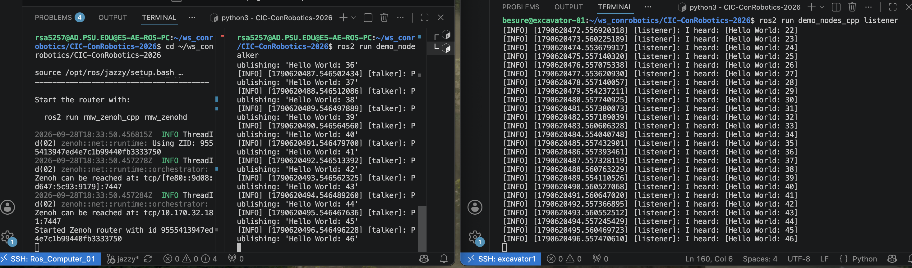

# Lab 01 — ROS 2 Network Setup

In this lab, you will connect your laptop to the course robotics computers and establish ROS 2 communication between two computers.

You will:

1. Prepare remote access from your laptop
2. Connect to a ROS PC using VS Code Remote SSH
3. Clone and build the course repository
4. Connect to your assigned Raspberry Pi
5. Connect both computers to the shared Zenoh network
6. Run a ROS 2 talker and listener across two computers

---

# Part 1 — Initial ROS PC Setup

## Step 1 — Log In to the ROS PC

For the initial setup, first log in to your assigned ROS PC physically using your Penn State account.

> **You only need to complete this initial setup once.**

### 1. Log in to Ubuntu

Log in using your Penn State account.

Wait until the Ubuntu desktop has fully loaded.

### 2. Open a Terminal

Click **Show Apps** at the bottom-left corner of the desktop.


Search for **Terminal** and open it.


A Terminal window should open.


You should see a command prompt similar to:

```text
your_psu_id@computer-name:~$
```

### 3. Confirm Your User Account

Run:

```bash
whoami
```

You should see your Penn State user ID.

---

# Part 2 — Prepare Your Laptop

From this point forward, use **your own laptop**.

## Step 2 — Open a Terminal on Your Laptop

### macOS

Open the built-in:

```text
Terminal
```

### Windows

For this lab, Windows users will use **Git Bash**.

### What is Git Bash?

Git Bash is a terminal application that comes with **Git for Windows**.

It gives Windows users a Linux-style terminal so that the SSH commands used in this lab work the same way as they do on macOS and Linux.

### If Git Bash is NOT Installed

1. Open the official **Git for Windows** download page. (https://git-scm.com/install/windows)
2. Download the Windows installer.
3. Run the installer.
4. The default installation options are fine for this lab.
5. After installation, open the Windows **Start Menu**.
6. Search for:

```text
Git Bash
```

7. Open **Git Bash**.

You should now see a terminal window.

> **Windows users:** Use Git Bash for the SSH setup commands in this lab.
> Do not use PowerShell for the `ssh-copy-id` step.

---

## Step 3 — Create an SSH Key

SSH (Secure SHell) is a way to securely access a different PC remotely.

An SSH key allows your laptop to connect to the ROS PC without entering your Penn State password every time.

### 1. Check for an Existing SSH Key

Run:

```bash
ls ~/.ssh/id_ed25519.pub
```

This command works in:

```text
macOS Terminal
Git Bash on Windows
```

If you see a file path such as:

```text
/Users/your_username/.ssh/id_ed25519.pub
```

or:

```text
/c/Users/your_username/.ssh/id_ed25519.pub
```

you already have an SSH key.

**Do not create another one.**

Continue to Step 4.

If you see:

```text
No such file or directory
```

continue below.

### 2. Generate an SSH Key

Run:

```bash
ssh-keygen -t ed25519
```

Press **Enter** to use the default file location.

When asked for a passphrase, press **Enter** without typing anything.

When complete, you should see messages similar to:

```text
Your identification has been saved in ...
Your public key has been saved in ...
```


### Checkpoint

- [ ] An SSH key already existed, or
- [ ] A new SSH key was successfully created.

---

## Step 4 — Connect to the PSU VPN

Before connecting remotely to the ROS PCs, connect your laptop to the **Penn State VPN using GlobalProtect**.

Connect to the Penn State VPN.

### Checkpoint

- [ ] Your laptop is connected to the Penn State VPN.
- [ ] GlobalProtect shows an active connection.

> Keep the VPN connected while using the course ROS computers remotely.

---

# Part 3 — Connect to the ROS PC

## Step 5 — Copy Your SSH Key to the ROS PC

Your instructor will assign you one of the two course computers:

```text
ROS-PC
ROS-Backup-PC
```

Your instructor will also provide its IP address.

### 1. Copy Your SSH Key

On **your laptop**, run:

```bash
ssh-copy-id 'YOUR_PSU_ID@AD.PSU.EDU'@ROS_COMPUTER_IP
```

Replace:

- `YOUR_PSU_ID` with your Penn State user ID
- `ROS_COMPUTER_IP` with the IP provided by the instructor

Example:

```bash
ssh-copy-id 'abc123@AD.PSU.EDU'@10.170.xx.xxx
```

### Windows Users

Run this command from **Git Bash**.

Do not use PowerShell for this step.

### 2. Confirm the First Connection

The first time you connect, you may see:

```text
The authenticity of host '10.170.xx.xxx' can't be established.

Are you sure you want to continue connecting (yes/no/[fingerprint])?
```


Type:

```text
yes
```

and press **Enter**.

This message is normal.

### 3. Enter Your Penn State Password

You may be asked for your Penn State password.

Your password will **not appear while you type**.

You will not see letters, dots, or asterisks.

This is normal.


If successful, you should see something similar to:

```text
Number of key(s) added: 1
```

### 4. Test the Connection

Run:

```bash
ssh 'YOUR_PSU_ID@AD.PSU.EDU'@ROS_COMPUTER_IP
```

If configured correctly, you should connect without entering your Penn State password.

The terminal prompt should look similar to:

```text
abc123@AD.PSU.EDU@E5-AE-ROS-PC:~$
```

To return to your laptop:

```bash
exit
```

---

# Part 4 — Configure VS Code Remote SSH

## Step 6 — Connect to the ROS PC Using VS Code

You will now configure **Visual Studio Code (VS Code)** to access the ROS PC remotely.

### 1. Open VS Code

Open **Visual Studio Code**.


### 2. Install Remote - SSH

Open the **Extensions** panel.


Search for:

```text
Remote - SSH
```

Install the extension from Microsoft.

If it is already installed, continue.

---

### 3. Open the SSH Configuration File

Open the VS Code **Command Palette**.

#### macOS

```text
Command + Shift + P
```

#### Windows

```text
Ctrl + Shift + P
```

Search for:

```text
Remote-SSH: Open SSH Configuration File...
```


Select your user SSH configuration file.

#### macOS

```text
~/.ssh/config
```

#### Windows

```text
C:\Users\YOUR_USERNAME\.ssh\config
```

---

### 4. Add the Course Computers

Add the configuration provided by your instructor.

The two ROS computers should be named:

```text
ROS-PC
ROS-Backup-PC
```

For example:

```text
Host ROS-PC
    HostName 10.170.xx.xxx
    User YOUR_PSU_ID@AD.PSU.EDU
    IdentityFile ~/.ssh/id_ed25519

Host ROS-Backup-PC
    HostName 10.170.xx.xxx
    User YOUR_PSU_ID@AD.PSU.EDU
    IdentityFile ~/.ssh/id_ed25519
```

You may also receive entries for the course robots:

```text
Host dumptruck1
    HostName 10.170.xx.xxx
    User besure
    IdentityFile ~/.ssh/id_ed25519

Host dumptruck3
    HostName 10.170.xx.xxx
    User besure
    IdentityFile ~/.ssh/id_ed25519

Host dumptruck4
    HostName 10.170.xx.xxx
    User besure
    IdentityFile ~/.ssh/id_ed25519

Host dumptruck5
    HostName 10.170.xx.xxx
    User besure
    IdentityFile ~/.ssh/id_ed25519

Host excavator1
    HostName 10.170.xx.xxx
    User besure
    IdentityFile ~/.ssh/id_ed25519

Host excavator2
    HostName 10.170.xx.xxx
    User besure
    IdentityFile ~/.ssh/id_ed25519

Host excavator3
    HostName 10.170.xx.xxx
    User besure
    IdentityFile ~/.ssh/id_ed25519

Host excavator4
    HostName 10.170.xx.xxx
    User besure
    IdentityFile ~/.ssh/id_ed25519

Host excavator5
    HostName 10.170.xx.xxx
    User besure
    IdentityFile ~/.ssh/id_ed25519

Host excavator6
    HostName 10.170.xx.xxx
    User besure
    IdentityFile ~/.ssh/id_ed25519

Host excavator7
    HostName 10.170.xx.xxx
    User besure
    IdentityFile ~/.ssh/id_ed25519
```

Replace:

```text
YOUR_PSU_ID
```

with your Penn State user ID.

Save the file.

---

### 5. Connect to the ROS PC

Open the Command Palette again.

Search for:

```text
Remote-SSH: Connect to Host...
```

Select either:

```text
ROS-PC
```

or:

```text
ROS-Backup-PC
```

depending on your assignment.

If VS Code asks for the operating system, select:

```text
Linux
```

### 6. Confirm the Connection

Look at the bottom-left corner of VS Code.

You should see your active remote connection.


> **Note:** The screenshot may show an older ROS PC name.
> For this course, use `ROS-PC` or `ROS-Backup-PC`.

### 7. Configure SSH Access to Your Assigned Raspberry Pi

You will also use VS Code Remote SSH to connect directly to your assigned Raspberry Pi.

Your instructor will assign a robot to your group, for example:

```text
excavator3
```

On **your laptop**, copy your SSH key to your assigned Raspberry Pi:

```bash
ssh-copy-id besure@IP_OF_YOUR_ASSIGNED_ROBOT
```

If a password is requested, use the Raspberry Pi password provided by the instructor.

> **Windows users:** Run `ssh-copy-id` from **Git Bash**.

After the key is copied, test the connection in **remote ssh on VS Code**. **Make sure you added the RaspberryPi on your configuration file.**

You can now connect to the Raspberry Pi.

### Checkpoint
- [ ] Remote - SSH is installed.
- [ ] Your assigned ROS PC appears in the host list.
- [ ] You can connect to the ROS PC.
- [ ] Your assigned Raspberry Pi appears in the host list.
- [ ] You can connect to your assigned Raspberry Pi.
- [ ] VS Code shows the correct active remote connection.

> Even though VS Code is displayed on your laptop, commands in a Remote SSH window are running on the **remote computer shown in the bottom-left corner of VS Code**.

---

# Part 5 — Download and Build the Course Repository

## Step 7 — Clone the Repository

Make sure your VS Code window is connected to your assigned **ROS PC**.

Open:

```text
Terminal → New Terminal
```

Create the course workspace:

```bash
mkdir -p ~/ws_conrobotics
cd ~/ws_conrobotics
```

Clone the repository:

```bash
git clone https://github.com/CICPSU/CIC-ConRobotics-2026.git
```

Enter the repository:

```bash
cd ~/ws_conrobotics/CIC-ConRobotics-2026
```

> **Do not switch branches.**
> The course labs use the repository's `main` branch.

---

## Step 8 — Build the ROS 2 Workspace

Run:

```bash
cd ~/ws_conrobotics/CIC-ConRobotics-2026

source /opt/ros/jazzy/setup.bash

colcon build --symlink-install

source install/setup.bash
```

Wait until the build completes successfully.

If the build fails, stop here and ask the instructor.

### Important

Whenever you open a new terminal for this course, you will normally need:

```bash
source /opt/ros/jazzy/setup.bash
source ~/ws_conrobotics/CIC-ConRobotics-2026/install/setup.bash
```

### Checkpoint

- [ ] The repository was cloned.
- [ ] `colcon build --symlink-install` completed successfully.
- [ ] `source install/setup.bash` completed successfully.

---

# Part 6 — Connect to Your Raspberry Pi

## Step 9 — Open Your Assigned Raspberry Pi

Your instructor will assign a Raspberry Pi to your group.

Examples include:

```text
dumptruck1
dumptruck3
dumptruck4
dumptruck5
excavator1
excavator2
excavator3
excavator4
excavator5
excavator6
excavator7
```

> Only connect to the Raspberry Pi assigned to your group.

**Before continuing, configure SSH access to your assigned Raspberry Pi using the same procedure you used earlier for the ROS PC.**

### 1. Keep Your ROS PC Window Open

You should already have one VS Code window connected to:

```text
ROS-PC
```

or:

```text
ROS-Backup-PC
```

Keep it open.

### 2. Open a Second VS Code Window

Use:

```text
Remote-SSH: Connect to Host...
```

Select your assigned Raspberry Pi.

For example:

```text
dumptruck1
```

### 3. Confirm Both Connections

You should now have:

```text
VS Code Window 1
    └── ROS PC

VS Code Window 2
    └── Raspberry Pi
```

Your laptop is connecting independently to both computers:

```text
                    Your Laptop
                    /         \
                   /           \
                  ▼             ▼
              ROS PC       Raspberry Pi
```

> **Always check which VS Code window and terminal you are using before running a command.**

### Checkpoint

- [ ] One VS Code window is connected to the ROS PC.
- [ ] One VS Code window is connected to the assigned Raspberry Pi.

---

# Part 7 — Connect Both Computers to ROS 2

## Step 10 — Start the ROS 2 Network Test

The course uses **Zenoh** to connect ROS 2 across multiple computers.

Only **one shared Zenoh router** should be running.

| Computer | Zenoh Profile |
|---|---|
| `ROS-PC` | `ros-pc` |
| `ROS-Backup-PC` | `ros-backup-pc` |

Your instructor will choose one student/group to start the Zenoh router.

> **Only one person should start the router.**
>
> If the router is already running, **do not start another one**.
> Continue to **B. Connect the ROS PC**.

---

### A. Start the Zenoh Router — ONE STUDENT ONLY

The instructor will tell you which computer will host the router.

Open a terminal on that ROS PC.

Run:

```bash
cd ~/ws_conrobotics/CIC-ConRobotics-2026

source /opt/ros/jazzy/setup.bash
source install/setup.bash
```

If the router is running on **ROS-PC**:

```bash
source network/setup_zenoh.sh router ros-pc
```

If the router is running on **ROS-Backup-PC**:

```bash
source network/setup_zenoh.sh router ros-backup-pc
```

Then start the Zenoh router:

```bash
ros2 run rmw_zenoh_cpp rmw_zenohd
```

**Keep this terminal running for the entire lab.**

> Do not run the router command again from another terminal or another student's account on the same ROS PC.

---

### B. Connect the ROS PC

Now open a **new terminal** on your assigned ROS PC.

Do not use the terminal running the Zenoh router.

Run:

```bash
cd ~/ws_conrobotics/CIC-ConRobotics-2026

source /opt/ros/jazzy/setup.bash
source install/setup.bash
```

Each Zenoh client needs two pieces of information:

```text
1. Which computer am I using?
2. Which computer is running the router?
```

The profiles are:

```text
ROS-PC        → ros-pc
ROS-Backup-PC → ros-backup-pc
```

Use:

```bash
source network/setup_zenoh.sh client <THIS_PC_PROFILE> <ACTIVE_ROUTER_PROFILE>
```

For example, if you are working on **ROS-PC** and the router is also on **ROS-PC**:

```bash
source network/setup_zenoh.sh client ros-pc ros-pc
```

If you are working on **ROS-Backup-PC** and the router is on **ROS-PC**:

```bash
source network/setup_zenoh.sh client ros-backup-pc ros-pc
```

Your instructor will tell you which router is active.

Now start the ROS 2 talker:

```bash
ros2 run demo_nodes_cpp talker
```

You should see:

```text
[INFO] [talker]: Publishing: 'Hello World: 1'
[INFO] [talker]: Publishing: 'Hello World: 2'
[INFO] [talker]: Publishing: 'Hello World: 3'
```

Keep this terminal running.

---

### C. Connect the Raspberry Pi

Go to the VS Code window connected to your assigned Raspberry Pi.

Open a terminal.

Run:

```bash
cd ~/ws_conrobotics/CIC-ConRobotics-2026

source /opt/ros/jazzy/setup.bash
source install/setup.bash
```

Connect the Raspberry Pi to the **same Zenoh router** used by the ROS PC.

Use:

```bash
source network/setup_zenoh.sh client <YOUR_ROBOT> <ACTIVE_ROUTER_PROFILE>
```

For example, if your robot is `dumptruck1` and the router is on **ROS-PC**:

```bash
source network/setup_zenoh.sh client dumptruck1 ros-pc
```

If the router is on **ROS-Backup-PC**:

```bash
source network/setup_zenoh.sh client dumptruck1 ros-backup-pc
```

Replace `dumptruck1` with your assigned robot.

Now start the listener:

```bash
ros2 run demo_nodes_cpp listener
```

If communication is working, you should see:


```text
[INFO] [listener]: I heard: [Hello World: 1]
[INFO] [listener]: I heard: [Hello World: 2]
[INFO] [listener]: I heard: [Hello World: 3]
```

You have successfully sent ROS 2 messages between **two different computers**!!



### Checkpoint

- [ ] Exactly one Zenoh router is running.
- [ ] The ROS PC talker is running.
- [ ] The Raspberry Pi listener is running.
- [ ] Both clients are using the same router.
- [ ] The Raspberry Pi receives `Hello World` messages.


---

# Part 8 — What Just Happened?

Your laptop is only being used to remotely control the other computers through SSH.

The ROS 2 programs themselves are running on the **ROS PC** and **Raspberry Pi**:

```text
                    Your Laptop
                   /           \
                SSH             SSH
                 ↓               ↓

              ROS PC       Raspberry Pi
               Talker        Listener
                  \            /
                   \          /
                    ▼        ▼
                 Zenoh Router
```

## Remember: Nodes and Topics

In class, we learned that ROS 2 systems are made of **nodes** that communicate through **topics**.

That is exactly what you just created.

```text
ROS PC                              Raspberry Pi

/talker                              /listener
  Node                                  Node
    │                                    ▲
    │ publishes                          │ subscribes
    ▼                                    │
               /chatter
                 Topic
    ─────────────────────────────────────►
```

In this lab:

| ROS 2 Concept | What You Just Used |
|---|---|
| **Node** | `/talker` |
| **Node** | `/listener` |
| **Topic** | `/chatter` |
| **Publisher** | Talker |
| **Subscriber** | Listener |
| **Message** | `Hello World` |

The important point is that the two ROS 2 nodes do **not** have to run on the same computer.

```text
ROS-PC
  /talker
      │
      │ publishes to /chatter
      ▼
    Zenoh
      │
      ▼
Raspberry Pi
  /listener
```

Zenoh allows the ROS 2 communication to travel between the computers.

---

## One Router, Many ROS 2 Clients

The network you created follows this basic structure:

```text
              Zenoh Router
             /      |      \
            /       |       \
           ▼        ▼        ▼
       ROS-PC      Pi 1      Pi 2
       Client     Client     Client
```

The important idea is:

```text
1 Zenoh Router
      +
N ROS 2 Clients
      +
ROS 2 Nodes communicating through Topics
```

Later in the course, the same basic network will connect many more ROS 2 nodes:

```text
ROS PC / Command Center
        │
        ├── Cameras
        ├── AprilTag Detection
        ├── Localization
        ├── Dump Trucks
        └── Excavators
```

The system will become much larger, but the basic ROS 2 idea stays the same:

```text
Nodes → communicate through Topics → across the ROS 2 network
```

---

# Submission

Submit **one set per group**.

Provide a screenshot showing:

- the ROS PC talker publishing `Hello World`
- the Raspberry Pi listener receiving `Hello World`
- enough of the VS Code windows or terminal prompts to identify the two computers

A single side-by-side screenshot is preferred.

If the text becomes too small, submit two readable screenshots.

---

# Before You Leave

Stop the talker and listener using:

```text
Ctrl + C
```

**Pleaes ask the instructor** whether to stop the shared Zenoh router.

You may then close your VS Code Remote SSH windows.

---

# Lab Complete

You have now:

- created an SSH key
- connected through the PSU VPN
- configured VS Code Remote SSH
- connected to a ROS PC
- cloned and built the course repository
- connected to a Raspberry Pi
- connected both computers to the Zenoh network
- sent ROS 2 messages between two computers

You are now ready to use the course multi-machine robotics system in future labs.