# Lab 02 — ROS 2 Excavator Control

In this lab, your team will control a physical model excavator using ROS 2.

You will:

1. Prepare your assigned Excavator Raspberry Pi
2. Identify the four excavator joints
3. Start the excavator ROS 2 system
4. Control one, two, and four joints using a YAML trajectory
5. Observe the ROS 2 system using `rqt_graph`
6. Create and record a short excavation motion

---

# Part 1 — Prepare Your Excavator Pi

## Step 1 — Connect to Your Assigned Excavator

Your instructor will assign an excavator to your group.

Examples:

- `excavator1`
- `excavator2`
- `excavator3`
- `excavator5`
- `excavator6`
- `excavator7`

Using **VS Code Remote SSH**, connect to the ROSPC and Raspberry Pi of your assigned excavator just as you did in Lab 01.

Make sure the VS Code window is connected to both **Excavator Pi**, and **ROS PC.**

---

## Step 2 — Download a Fresh Copy of the Repository

For this lab, **do not use an old copy of the repository on the ROS-PC.**

Open a terminal on the ROS PC and run:

```bash
cd ~/ws_conrobotics || exit 1

rm -rf CIC-ConRobotics-2026

git clone https://github.com/CICPSU/CIC-ConRobotics-2026.git

cd CIC-ConRobotics-2026
```

This intentionally removes the old course repository from the ROS-PC and downloads a clean copy.

> ⚠️ Make sure you are working on your assigned **ROS-PC** before running these commands.

---

## Step 3 — Build the Workspace

After downloading a fresh copy, **always build the workspace before running the robot.**

On **ROS-PC** Run:

```bash
source /opt/ros/jazzy/setup.bash

colcon build --symlink-install

source install/setup.bash
```

Wait until the build completes successfully.

If the build fails, stop here and ask the instructor.


### Checkpoint

Before continuing:

- [ ] We are connected to the correct Excavator Pi.
- [ ] We downloaded a fresh copy of the repository.
- [ ] `colcon build --symlink-install` completed successfully.

---

# Part 2 — Explore the Excavator

## Step 4 — Identify the Four Joints

Before controlling the robot with ROS 2, use the handheld controller to understand how the excavator moves.

Move **one joint at a time**.

Keep the movements small.

Identify:

| Joint | Motion |
|---|---|
| **Swing** | Rotates the upper body |
| **Boom** | Raises and lowers the main boom |
| **Arm** | Extends and retracts the arm |
| **Bucket** | Opens and closes the bucket |

Think about:

- Which joints create a digging motion?
- Which joint turns the excavator toward a dump location?

### Checkpoint

- [ ] We can identify all four joints.
- [ ] We understand which joint rotates the excavator.
- [ ] We returned the robot to the instructor-approved starting position.

---

# Part 3 — Start the Excavator ROS 2 System

## Step 5 — Activate the Perception System

Start Zenoh on the **first terminal**. Keep this terminal running.

If you are using **ROS-PC**, run:

```bash
cd ~/ws_conrobotics/CIC-ConRobotics-2026
source /opt/ros/jazzy/setup.bash
source install/setup.bash
source network/setup_zenoh.sh router ros-pc
ros2 run rmw_zenoh_cpp rmw_zenohd
```

If you are using **ROS-Backup-PC**, run:

```bash
cd ~/ws_conrobotics/CIC-ConRobotics-2026
source /opt/ros/jazzy/setup.bash
source install/setup.bash
source network/setup_zenoh.sh router ros-backup-pc
ros2 run rmw_zenoh_cpp rmw_zenohd
```

> Use your assigned ROS PC as the Zenoh router for this lab.

The excavator uses the overhead camera and AprilTag system for **Swing feedback**.

The example below uses `excavator3`.

You need to run this on the **second terminal on ROS-PC**.

```bash
cd ~/ws_conrobotics/CIC-ConRobotics-2026

source /opt/ros/jazzy/setup.bash
source install/setup.bash
source network/setup_zenoh.sh client ros-pc

ros2 launch construction_site_control \
  command_center.launch.py \
  excavators:=excavator3 \
  start_scenario_manager:=false
```
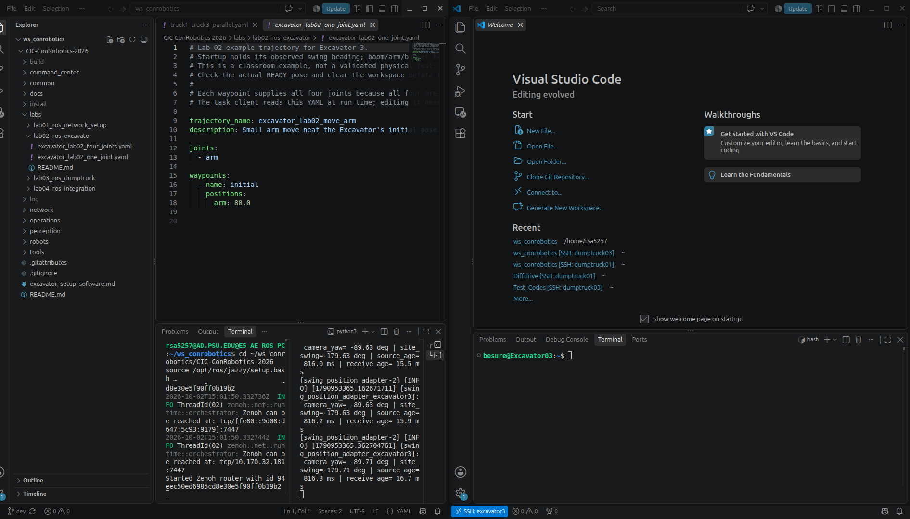


If you are using **ROS-Backup-PC**, use `ros-backup-pc` instead:

```bash
cd ~/ws_conrobotics/CIC-ConRobotics-2026

source /opt/ros/jazzy/setup.bash
source install/setup.bash
source network/setup_zenoh.sh client ros-backup-pc ros-backup-pc

ros2 launch construction_site_control \
  command_center.launch.py \
  excavators:=excavator3 \
  start_scenario_manager:=false
```


---

## Step 6 — Start Your Excavator

Return to the terminal connected to your **Excavator Pi**.

The example below uses `excavator3`.

Replace `excavator3` with your assigned excavator name if needed.

If your group is using **ROS-PC as the Zenoh router**, run the following on the **Excavator Pi**:

```bash
cd ~/ws_conrobotics/CIC-ConRobotics-2026

source /opt/ros/jazzy/setup.bash
source install/setup.bash
source network/setup_zenoh.sh client excavator3

sudo pigpiod

ros2 launch excavator_control \
  excavator.launch.py \
  mode:=pi \
  robot_name:=excavator3
```

If your group is using **ROS-Backup-PC as the Zenoh router**, run the following on the **Excavator Pi**:

```bash
cd ~/ws_conrobotics/CIC-ConRobotics-2026

source /opt/ros/jazzy/setup.bash
source install/setup.bash
source network/setup_zenoh.sh client excavator3 ros-backup-pc

sudo pigpiod

ros2 launch excavator_control \
  excavator.launch.py \
  mode:=pi \
  robot_name:=excavator3
```


Keep this terminal running.

You would need to enter password for running sudo. Ask the instructor for the password.

Wait until the excavator completes startup.

Do not send a trajectory while the robot is still initializing.

Screen shot with two ROS terminals and one Pi terminal.
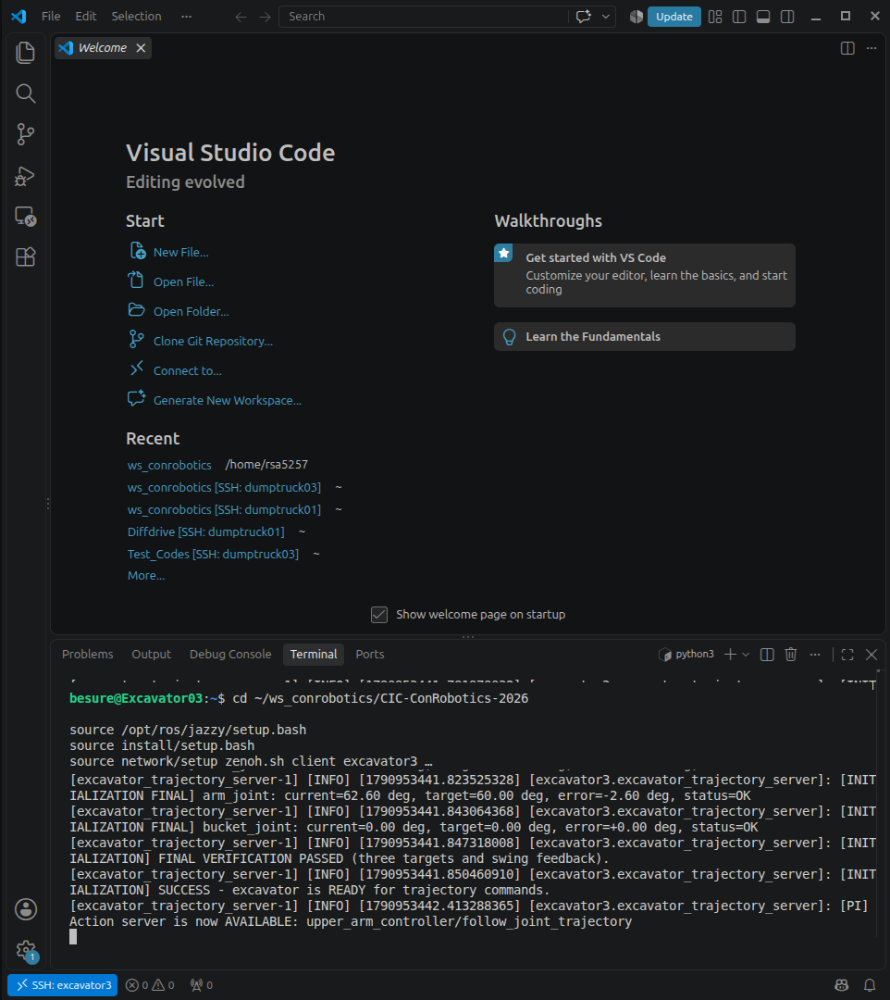


---

# Part 4 — Control the Excavator

You will now send trajectories from the **ROS-PC**.

Run below on the **third terminal on ROS-PC**.

Run:

```bash
cd ~/ws_conrobotics/CIC-ConRobotics-2026
source /opt/ros/jazzy/setup.bash
source install/setup.bash
source network/setup_zenoh.sh client ros-pc
```
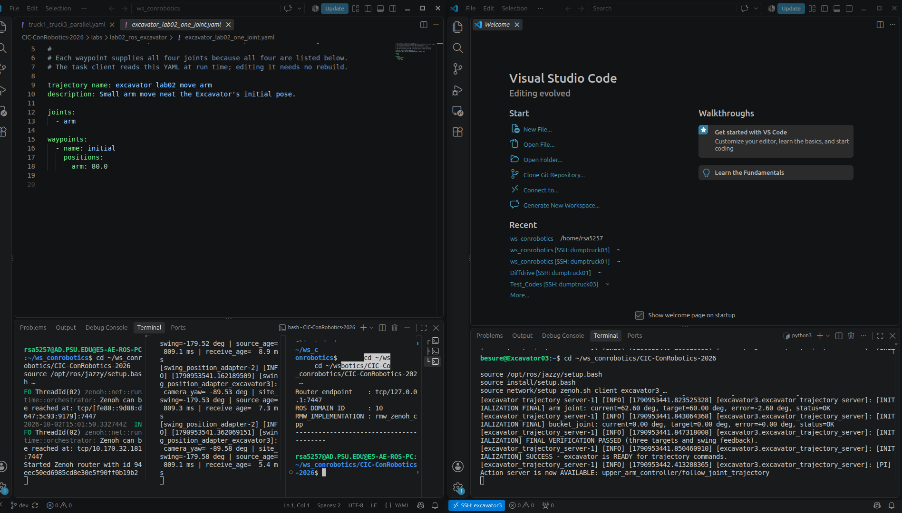


If you are using **ROS-Backup-PC**, use:

```bash
cd ~/ws_conrobotics/CIC-ConRobotics-2026
source /opt/ros/jazzy/setup.bash
source install/setup.bash
source network/setup_zenoh.sh client ros-backup-pc ros-backup-pc
```


---

## Step 7 — Create a One-Joint Trajectory

Create a new file: (You can copy/paste and rename the existing file as shown below)

```text
~/ws_conrobotics/CIC-ConRobotics-2026/labs/lab02_ros_excavator/GroupX_onejoint_trajectory.yaml
```

Start with **one joint only**.

Example is shown here ~/ws_conrobotics/CIC-ConRobotics-2026/labs/lab02_ros_excavator/excavator_lab02_one_joint.yaml:

```yaml
trajectory_name: excavator_lab02_move_arm
description: Small arm move r the Excavator's initial pose.

joints:
  - arm

waypoints:
  - name: initial
    positions:
      arm: 80.0

```
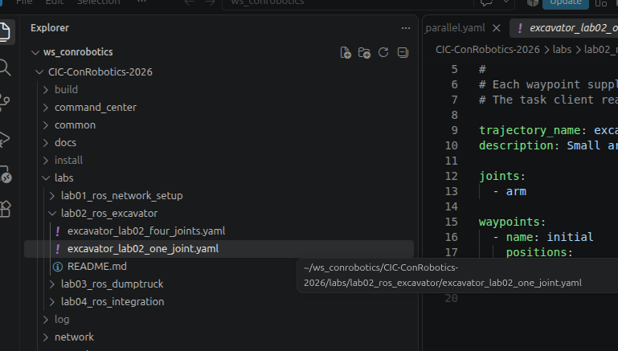
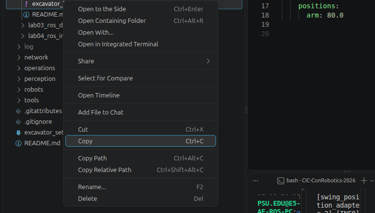
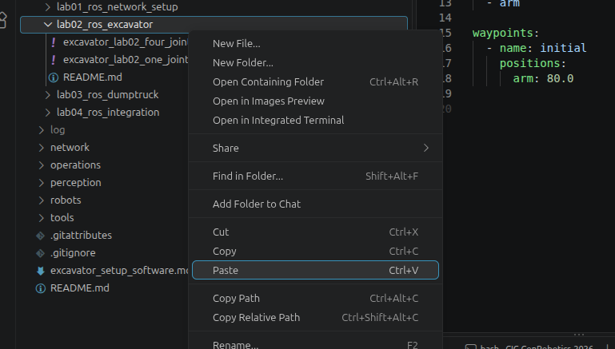
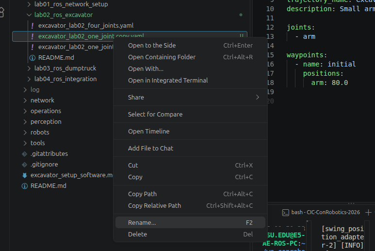
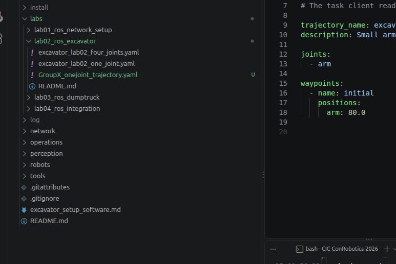
Use only a **small movement** for your first test.

Save the file.

---

## Step 8 — Run the One-Joint Trajectory

Run below on the **third terminal on ROS-PC**:

```bash
ros2 run construction_site_control \
  excavator_task_client \
  ~/ws_conrobotics/CIC-ConRobotics-2026/labs/lab02_ros_excavator/GroupX_onejoint_trajectory.yaml \
  --robot excavator3 \
  --seconds-per-waypoint 5.0
```

Replace the `trajectory file name` and `excavator3` with your assigned excavator.

Watch the physical excavator.

Only the joint listed in the YAML file should be commanded.


Screeshot
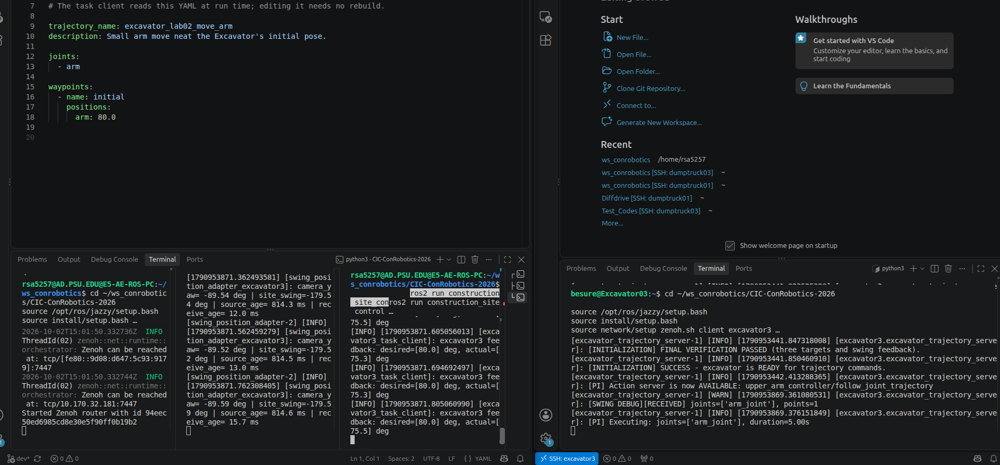

### Checkpoint

- [ ] The trajectory was accepted.
- [ ] The expected joint moved.
- [ ] The movement stayed within the approved range.

---

# Part 5 — Look at the ROS Graph

## Step 9 — Open `rqt_graph`

On the **Fourth terminal of the ROS-PC**, open a terminal and use the same ROS 2 / Zenoh setup:

```bash
cd ~/ws_conrobotics/CIC-ConRobotics-2026
source /opt/ros/jazzy/setup.bash
source install/setup.bash
source network/setup_zenoh.sh client ros-pc
rqt_graph
```
If you are using **ROS-Backup-PC**, use:

```bash
cd ~/ws_conrobotics/CIC-ConRobotics-2026
source /opt/ros/jazzy/setup.bash
source install/setup.bash
source network/setup_zenoh.sh client ros-backup-pc ros-backup-pc
rqt_graph
```

Take a screenshot.

Save it as:

```text
groupX_graph.png
```

rqt-graph
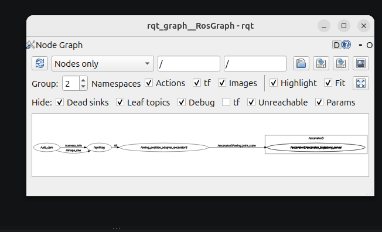

**Hit refresh on rqt_graph while the joint is moving.** Take a screenshot.

Save it as:

```text
groupX_graph_action.png
```

Compare the two and see the difference.

---

# Part 6 — Add More Joints

## Step 10 — Control Two Joints

Modify your YAML file so it controls **two joints**.

For example:

```yaml
trajectory_name: lab02_two_joints
description: Arm and bucket test

joints:
  - arm
  - bucket

waypoints:
  - name: start
    positions:
      arm: REPLACE_WITH_FIRST_TARGET_ANGLE
      bucket: REPLACE_WITH_SECOND_TARGET_ANGLE

  - name: scoop
    positions:
      arm: REPLACE_WITH_FIRST_TARGET_ANGLE
      bucket: REPLACE_WITH_SECOND_TARGET_ANGLE
```

Every waypoint must contain a position for **both joints**.

Refer to the pictures below for the ranges of each joint
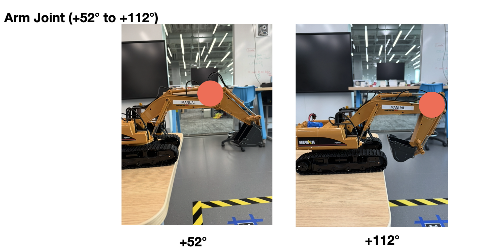
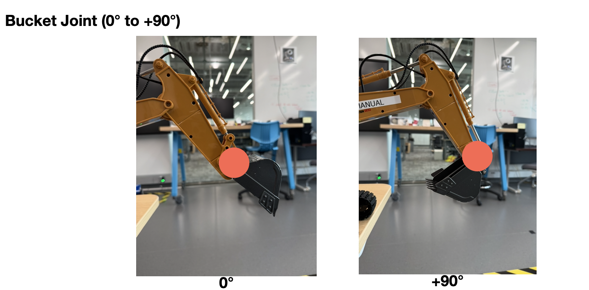
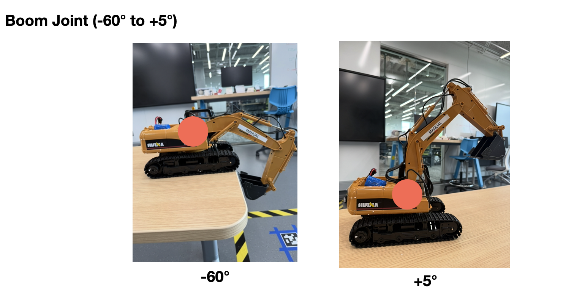


You can get your current joints angles using this ros2 topic just make sure to change Excavator 3 to your assigned Excavator# (Run it on ROS-PC)

Run below on the **fourth terminal on ROS-PC**:

```bash
ros2 topic echo /excavator3/joint_states --once | python3 -c "import sys,yaml,math; m=next(yaml.safe_load_all(sys.stdin)); print('\nJOINT ANGLES\n' + '\n'.join(f'{n:<25} {math.degrees(p):>8.2f}°' for n,p in zip(m['name'],m['position'])))"
```
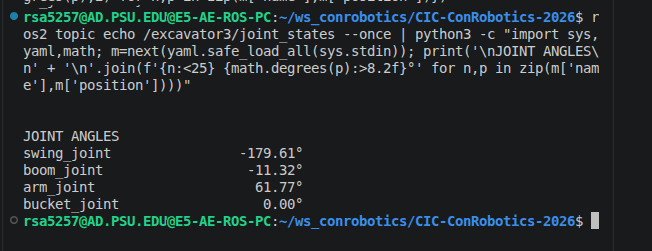

Save the file and run the same command again:

```bash
ros2 run construction_site_control \
  excavator_task_client \
  ~/ws_conrobotics/CIC-ConRobotics-2026/labs/lab02_ros_excavator/GroupX_onejoint_trajectory.yaml \
  --robot excavator3 \
  --seconds-per-waypoint 5.0
```

**Try moving all the joints.**

For Swing:

- `0°` points away from the window (`+x` direction of the construction site)
- Clockwise rotation is **positive**
- Counterclockwise rotation is **negative**
- Swing targets must stay between `-180°` and `+180°`

Choose a target that does not require rotating beyond this range.
Use a clearly visible but safe movement approved by the instructor.


### Checkpoint

- [ ] Both joints are listed under `joints`.
- [ ] Every waypoint contains both joints.
- [ ] The excavator performs the expected motion.

---

# Part 7 — Create a Four-Joint Excavation Motion

## Step 11 — Use All Four Joints

Now modify the YAML file to use:

```yaml
joints:
  - swing
  - boom
  - arm
  - bucket
```

Create a short sequence similar to:

```text
Approach
   ↓
Lower
   ↓
Scoop
   ↓
Lift
   ↓
Swing
   ↓
Dump
   ↓
Return
```

Each waypoint must include:

```yaml
positions:
  swing: ...
  boom: ...
  arm: ...
  bucket: ...
```

Example is shown here: ~/ws_conrobotics/CIC-ConRobotics-2026/labs/lab02_ros_excavator/excavator_lab02_four_joints.yaml


---

## Step 12 — Run the Four-Joint Trajectory

Run the same trajectory command on the **third terminal on ROS-PC**:

```bash
ros2 run construction_site_control \
  excavator_task_client \
  ~/ws_conrobotics/lab02/groupX_four_joint_trajectory.yaml \
  --robot excavator3 \
  --seconds-per-waypoint 5.0
```

Replace `excavator3` with your assigned excavator.

Watch the complete excavation motion.


---

# Part 8 — Final Excavation Motion

Create a short final motion that includes:

1. Lower
2. Scoop
3. Lift
4. Swing
5. Dump
6. Return

Record a short video of the excavator performing the motion.

Keep everyone clear of the robot while it is moving.

---

# Submission

Submit **one set per group**:

- Short video of the final excavation motion
- `your_final_trajectory.yaml`
- `groupX_graph.png`
- `groupX_graph_action.png`


---

# Before You Leave

- Close all the terminal with Ctrl+C (Stop your trajectory program, Close `rqt_graph`, etc.)
- Follow the instructor's directions before turning off the excavator.

---

# Lab Complete

You have now moved from basic ROS 2 communication to controlling a physical robot.

You used:

```text
YAML Trajectory
      ↓
ROS 2 Client
      ↓
ROS 2 Action
      ↓
Excavator Controller
      ↓
Physical Excavator
```

